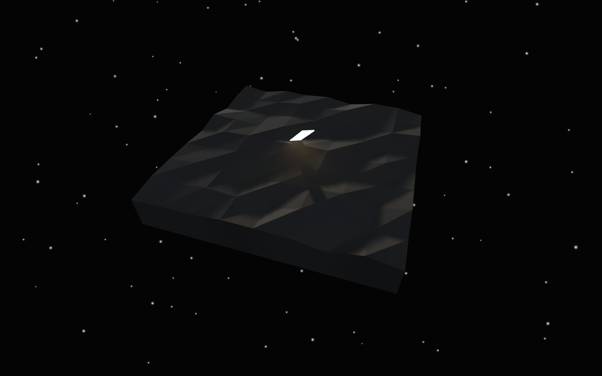
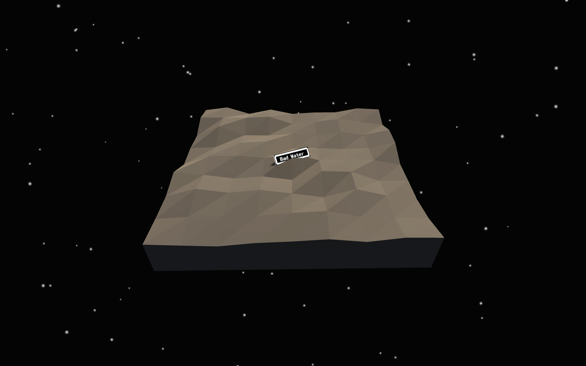
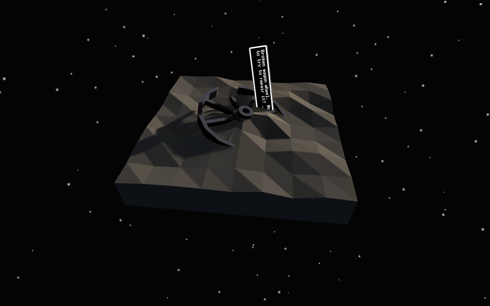
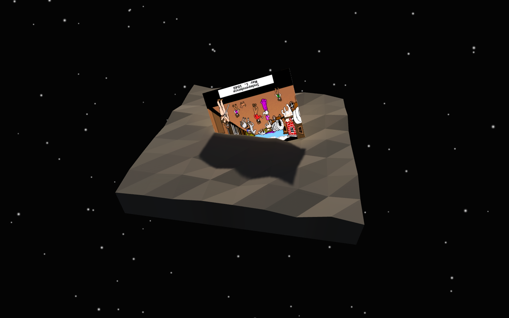
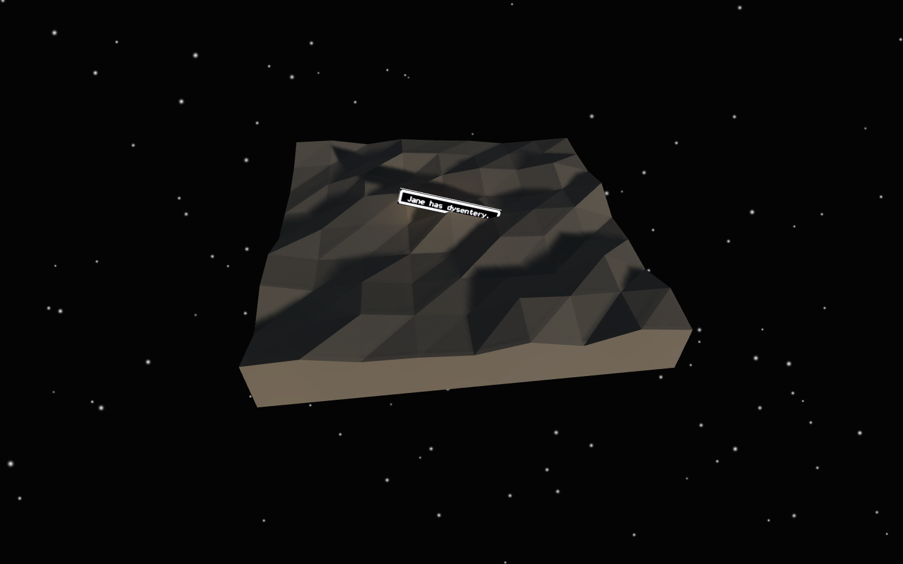
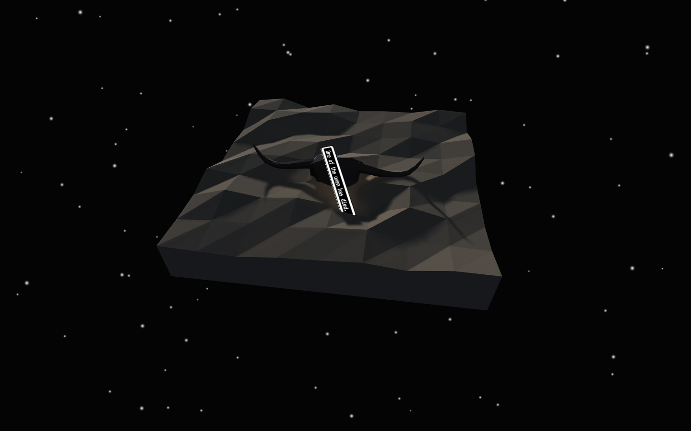
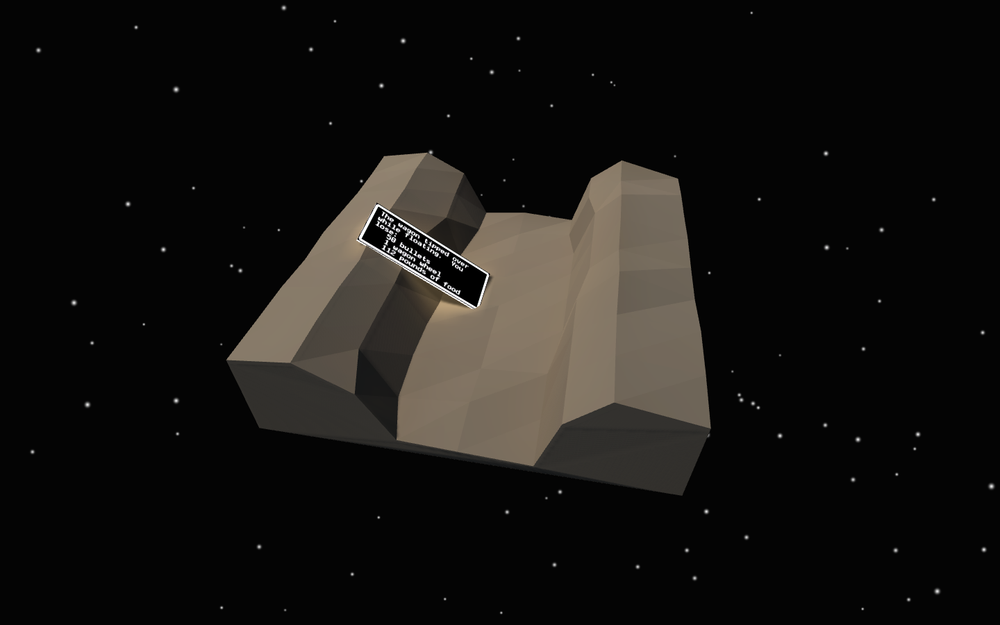
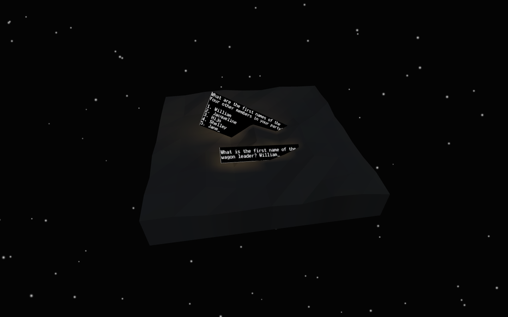

# *Independence, Missouri*

## Information
* Released: 21 July, 2016
* Website: http://www.pippinbarr.com/
* Platforms: Mac, Windows
* Link: https://pippinbarr.itch.io/independence-missouri
* Price: Free.

## Description
Everyone in the party has died! Nothing beside remains! Round the decay of
that colossal wreck, boundless and bare the lone and level sands stretch far
away!Now you can at least look like one! Pretend you're playing chess! Make moves!
Act like you feel things! Smirk! Frown! Weep! Chess!

## History
Independence, Missouri was made over two weeks for the itch.io and JUEGOS
RANCHEROS Mystic Western Game Jam. It draws on two key reference points for
its aesthetics and narrative. Primarily the game works with the imagery and
story of the classic educational adventure game The Oregon Trail (1971).
Most directly, Independence, Missouri is the town that The Oregon Trail
begins at.

Visually, Independence, Missouri presents dioramas featuring illuminated
screenshots of a specific playthrough of The Oregon trail culminating in the
typical ending of the entire party's death through the now-famous misfortunes
such as dysentery and snake bites. Here and there, players will find objects
as well, representing some of those misfortunes, and also serving as the models
for constellations that appear in the sky if enough time is spent meditating
on them.

Along with The Oregon Trail, Independence, Missouri was in part inspired by
the poem Ozymandias by Percy Bysshe Shelley. In the poem, the protagonist
hears about the shattered remains of a once great and boastful king's
kingdom. Imagine something deep about the apparent grandeur of standard
videogame playthroughs as compared to the nothingness they leave behind if
you like.

The game was made largely with Unity and Blender, both rather ineptly, but,
in the end, satisfactorily.

## Features
* The Great Outdoors.
* White water rafting.
* Hunting.
* A snake.
* Dysentery.

## Images

## Trailer
[View the trailer on YouTube](https://youtube.com/watch?v=uxiWRma_wxw)

## Links
* [The Mystic Western Game Jam](https://itch.io/jam/mysticwestern): Independence, Missouri was made as part of the itch.io and JUEGOS RANCHEROS Mystic Western Game Jame
* [The Oregon Trail](https://archive.org/details/msdos_Oregon_Trail_The_1990): You can pay the original The Oregon Trail on archive.org

## Credits
* Pippin Barr: Everything
